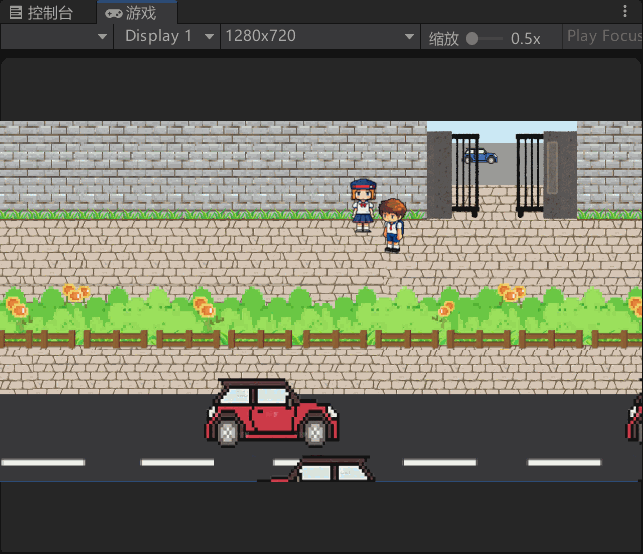

## Soft-Village Slipper~(这里搞错确略显尴尬~
版本：2022.3.52f1c1
忽略：Temp/,Logs/,UserSettings/,Library/

-----

### 2/11

?. 似乎在unity里并不是很好用，因为对象被销毁并不是null？

？？？那为什么用if != null 不会报错， 不是简单的语法糖吗？

不想做对话😣

### 2/13

(我是ai Api boy

defect：

- 没有上下文
- 连接很不稳定（实现方式相当贻笑大方）

为什么我感觉这 LTS 的 Unity Bug 也挺多的 😭

### 参考/使用开源项目：

- https://github.com/AdaTomruk/GroqUnityLibrary
- https://github.com/TakWolf/fusion-pixel-font.git
